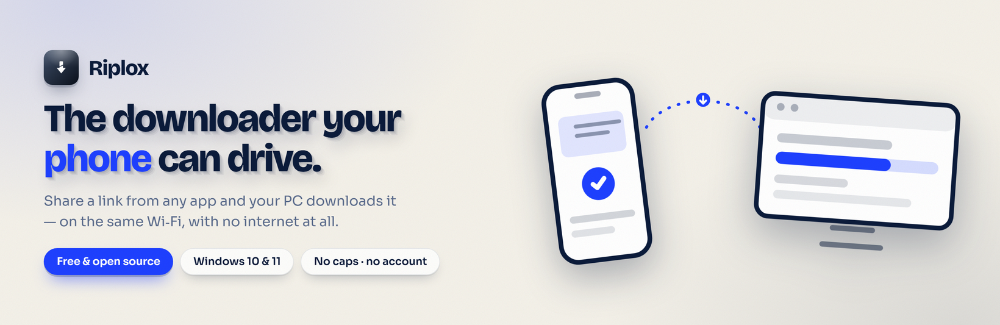
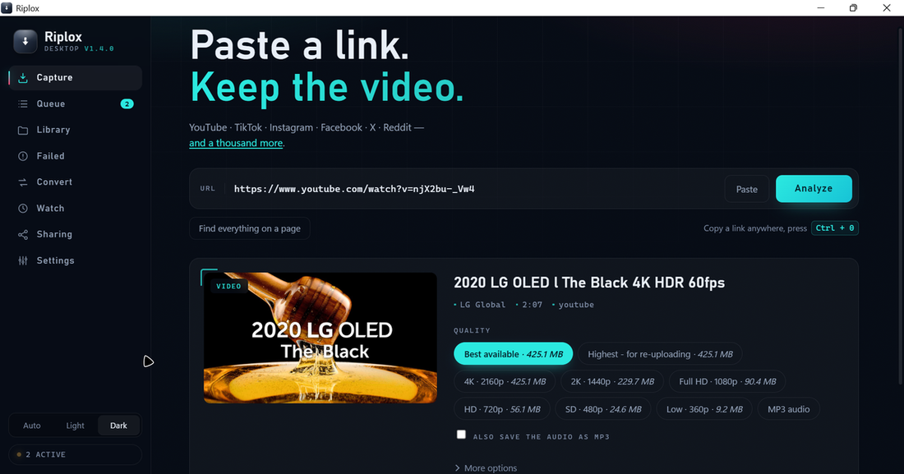
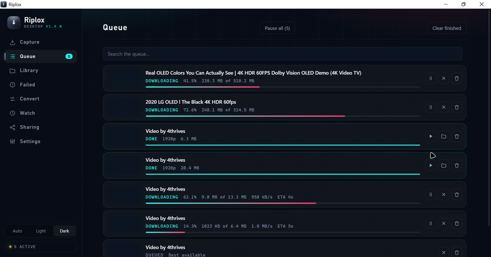
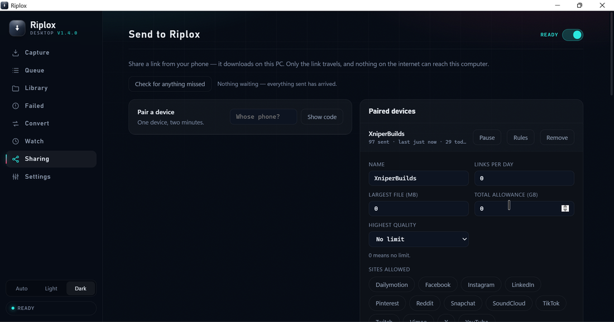
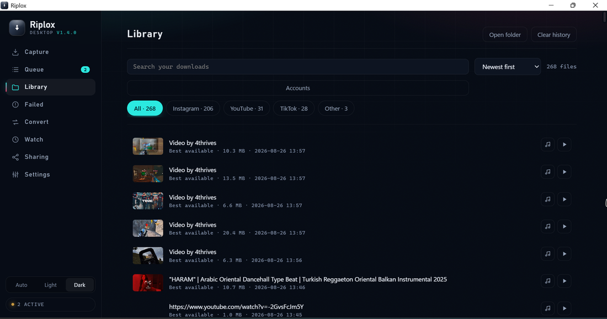

# Riplox Desktop

A free, open-source **yt-dlp GUI for Windows**. Paste a link and keep the file, or
send a video from your phone — share a link from any app and the PC downloads it,
with no Docker, no server to run and no account.

Works with YouTube, TikTok, Instagram, Facebook, X, Reddit and around a
thousand other sites.

[](https://github.com/xniperbuilds/riplox-desktop/releases/latest)
[](https://github.com/xniperbuilds/riplox-desktop/releases)
[](LICENSE)




| Paste and pick | The queue | Your phone drives it | Everything you kept |
|:---:|:---:|:---:|:---:|
|  |  |  |  |

- **Your phone can drive it.** Pair a phone once and its share sheet gains a
  Riplox entry. On the same Wi-Fi the link never leaves your network and needs
  no internet at all; anywhere else it travels sealed. Only the link travels —
  your PC fetches the video on its own connection, and never opens a port.
- **No limits.** No download caps, no daily quota, no watermark, no account, no
  paid tier. Nothing is held back for a licence: every quality the site has,
  every video in a playlist, as many at once as you set, private and
  members-only videos through your own sign-in, and a proxy if you use one —
  all of it, in the only version there is.
- **No bundled software.** The installer contains the app and nothing else.
- **Plays anywhere.** Files come out as MP4, in H.264 wherever a site offers
  that resolution in H.264, so they open in Windows Media Player, WhatsApp and
  on phones without extra codecs. Where the highest resolution exists only in a
  newer codec, Riplox takes the resolution.
- **Updates itself.** Sites change how they serve video; the download engine
  can be updated from inside the app without waiting for a new release.
- **Keeps working when the engine does not.** Every desktop downloader is built
  on the same engine, so when a site refuses it they all fail on the same day.
  Riplox has a second way in for YouTube, TikTok, Instagram and Facebook, and
  takes it on its own.

## Features

| | |
|---|---|
| Quality | 8K, 4K, 1440p, 1080p, 720p, 480p, 360p, or MP3 audio with cover art and tags. A rung is offered only where the video really has it, and one that exists only as VP9 or AV1 says so before you press anything |
| Playlists | The whole playlist in one click, or tick only the ones you want — filter by title, sort by length or name, take the first N, invert, shift-click ranges, and a download button on each row |
| Channels | A channel link opens its sections — Videos, Shorts, Live — and any one of them behaves as an ordinary playlist |
| Queue | Several at once, with live speed and ETA, real pause and resume, and a speed limit |
| Clipboard | Copy a link anywhere and Riplox catches it, even while hidden. Optionally queue it without asking |
| Shortcut | A global hotkey downloads whatever link you just copied, without switching windows |
| Drag and paste | Drop a link on the window, or paste twenty at once |
| Trim | Cut a section out by timestamp, with exact-cut frames when you need them |
| Subtitles | Download or embed them — the ones somebody wrote, the machine-written ones, or both — keep chapters, or skip sponsor segments |
| Dubbed audio | Take one language, or every dub the video has, each as its own file |
| Cover picture | Choose from the ones the site offers instead of taking its default; kept beside the file and put inside it where the format allows |
| Convert | Anything already on the disk: MP3, M4A, OPUS, FLAC or WAV for the sound, or MP4, MKV, MOV and WebM for the video, with an optional shrink to 1080p, 720p or 480p and a short GIF. Remuxed rather than re-encoded when the codec already fits, so an MP4 into an MKV finishes in a second. Never scaled up, and the original is never touched |
| Following | Follow a channel or playlist and be told what is new — read from the site's own published feed where there is one, so it can be checked every fifteen minutes and a hundred can be followed. Nothing downloads unless you turn that on for that channel |
| Find on a page | Point it at a page and it lists every media link on it, in the same screen playlists use |
| Schedule | Hold new downloads outside chosen hours, or give one download its own start time — 02:00 means tonight, and the row says how long it is waiting. A download already running is never cut off |
| Send to Riplox | Share a link from your phone or another PC and this one downloads it — see below |
| Start with Windows | Optional, and it starts into the tray rather than onto your screen |
| Tray | Closing the window keeps downloads running, with progress on the taskbar button and a notification when each file lands |
| Sign-in | Sign in through your own browser for private, members-only and age-gated videos |
| Library | Every finished file, with search, sort, a filter per site, play and show-in-folder |
| Backup | Export and import your settings; export your links as txt, csv or json |
| Proxy | http, https or SOCKS. With SOCKS the second route stands aside rather than go around it |
| Themes | Light and dark, or whichever the system is using |

### When a site refuses

Almost every desktop downloader is a front end for the same engine, so a site
that starts refusing it breaks all of them at once, and the usual advice — try
a different connection — is not a fix.

Riplox has a second route of its own for the four sites that matter most:
YouTube, TikTok, Instagram and Facebook. It runs only after the engine has
actually failed, so an ordinary download never goes through it and it cannot
quietly take over a site the engine handles better. It uses no browser, no
signing and no impersonation — a plain request with the headers a browser would
send, and a cookie jar that keeps what the site hands back.

Above 360p, YouTube hands the picture and the sound over as separate files;
Riplox fetches both and joins them. Without `ffmpeg` it says so and takes the
single combined stream instead, rather than dropping to 360p silently.

An address a site publishes is checked before anything is fetched from it: it
must be https and belong to that site's own network. These pages carry text
other people wrote, and a caption can contain something shaped exactly like a
video address.

If a proxy is set, this route uses it too — and where it cannot, it refuses to
run rather than going around it. The whole point of setting one is that
requests do not leave any other way.

### Send to Riplox

Pair a phone once and share a link to it from any app; the download starts on
this PC, on this PC's connection and disk.

The PC **never opens a port**. It dials out to a relay and holds one request
open, so nothing on the internet can reach the machine. Every message is
AES-GCM ciphertext with a nonce and a timestamp: the relay carries it without
being able to read it, and a captured message cannot be replayed. Only a link
travels — never a video.

The phone generates its own key during pairing, so the pairing code is spent
the moment it is used; a code left in a chat afterwards opens nothing. Codes
last two minutes and work once.

Each paired device can be paused, renamed, limited (per day, largest file,
total GB, quality cap, which sites) and given a folder of its own, or removed
outright. A removed phone is told it was removed rather than left guessing.

Two ways in on the phone: a web page that needs nothing installed, or
**Riplox Send**, a small Android app that takes a share without opening
anything at all — source in [`send-android/`](send-android/). Both are offered
from the pairing link. The relay is in [`relay/`](relay/).

Riplox Send keeps itself up to date without a store: it asks the relay what
version is there and, if it is newer, offers it. The download is checked
against the published SHA-256 as it arrives and thrown away if it does not
match; Android's own dialog does the installing.

There is a Windows sender too — [`send-windows/`](send-windows/), released
beside Riplox itself. Windows has no share sheet, so it earns its place on the
keyboard instead: copy a link in any program, press <kbd>Ctrl+Shift+S</kbd>, and
it is on its way. Nothing opens; the answer arrives as a notification.

### The short way, when both are on the same Wi-Fi

The relay exists because the phone and the PC are usually *not* on the same
network — and none of the above needs them to be. But when they are, sending a
link to another continent and back is a long way to move a few hundred bytes.

So the app tries the local network first. Riplox listens on **47811** and
answers two things: a ping, and a sealed envelope. If the PC answers there, the
link never leaves the building.

The phone is never told where the PC is in advance, because that answer goes
stale: an address moves with DHCP and changes completely between networks.
Instead **every sealed reply carries the addresses the PC can currently be
reached at**. The relay never sees them — it holds ciphertext it cannot open —
and a PC that moved network corrects itself on the very next send. It sends all
of its addresses rather than choosing one: which is reachable depends on the
*phone's* network, not on the PC's opinion of itself.

Details that stop this being worse than the relay it replaces:

- **The room must match.** Another Riplox on the same Wi-Fi would answer a ping
  happily; handing it someone else's message is worse than not trying at all.
- **The same sealed envelope goes either way.** If the local attempt arrived and
  only its answer was lost, the relay copy carries an identical nonce and the PC
  refuses it as a repeat instead of downloading it twice.
- **Every check fails open.** They exist to make the attempt cheap, so when one
  cannot answer it lets the attempt happen anyway — a check that fails closed
  turns "I could not tell" into "never use the local network", and a feature
  that never happens looks exactly like one that was never built.
- **Cleartext, deliberately.** What travels is the AES-GCM envelope the relay
  also cannot read. TLS would wrap ciphertext in ciphertext, and no certificate
  authority issues for `192.168.x.x`.

⚠ **The web page cannot do this**, and that was measured rather than assumed: a
page served over HTTPS is forbidden by the browser from calling
`http://192.168.x.x` at all. The local path belongs to the two native senders.

Incoming says **on your network** beside anything that arrived this way, so the
claim is shown rather than made.

Opening a pairing link on Windows hands it to that app rather than to the
browser: it registers `riploxsend://` when it installs, and the pairing page
asks which one the code is for. The code works once, so pairing the browser
would spend it and leave the app needing a second one.

### Following a channel

Follow a channel or a playlist and Riplox checks it on a timer and lists what
it has not seen before. **Nothing downloads unless you turn that on for that
channel** — and even then it needs the switch in Settings as well, and takes at
most three new videos per check.

Most of it is not scraping at all. YouTube publishes an Atom feed for every
channel and every playlist; where one can be worked out, that is what a routine
check reads — a public page, no sign-in, about ten kilobytes — so those can be
checked as often as every fifteen minutes, and you can follow a hundred things.

The engine is still used for three jobs the feed cannot do: the first look when
you follow something (a feed holds only the newest fifteen), an occasional full
check to catch what the feed missed, and any site that has no feed. Those are
the requests a site can answer with "are you a bot", so they keep the old
limits — at most every six hours, one at a time, ninety seconds apart, whatever
the interval is set to. Each row says which of the two it is. The screen
explains all of this before following can be switched on, and carries the fix
if a bot check ever happens.

### AI-upscaled video

YouTube generates higher-resolution versions of older uploads with AI and
offers them beside the original. Riplox skips them by default, because
"download this video" means the video. A rung that only exists as an upscale
is therefore not offered at all — and if you turn them on in Settings, the
quality chip says what it really is: *1080p · AI-upscaled from 480p*.

### Cookies

Chrome, Edge and Brave encrypt their cookie database so that only the browser
itself can read it (Chrome 127, July 2024). Nothing here tries to break that.
Instead, **Sign in with your browser** opens the browser you already have on a
profile of its own; once you have signed in and closed the window, Riplox asks
that browser for its cookies over the DevTools protocol — the browser's own
supported interface. Your normal browser profile is never opened or copied.

What is captured is stored encrypted with DPAPI, is written out in the clear
only into a temp file for the length of one download, and is only ever handed to
the site it came from. There is one encrypted file per site, so signing out of
one site deletes that file and touches nothing else. Firefox still works
directly, and an exported `cookies.txt` can be used instead.

Signing in is optional — public videos do not need it. Downloading heavily
while signed in can get that account limited by the site, so a spare account is
the safer choice.

### YouTube

YouTube expects requests to carry a token proving they came from a real player,
and answers "Sign in to confirm you're not a bot" when one is missing. Riplox
deals with this in three layers, none of which involve an account:

- A JavaScript runtime (QuickJS, 2 MB) ships with the app. Without one, YouTube's
  newer streaming path hands back formats that have no download URL at all.
- Requests are paced, and a refusal is retried automatically on a different
  player client. Most of these clear on their own.
- An optional helper that generates the token locally can be downloaded from
  Settings. It is off by default, checked against a pinned SHA-256 before it is
  run, listens only on 127.0.0.1, and can be removed with one click.

## Install

Download the setup file from the releases page and run it. It installs for the
current user, so it does not ask for administrator rights.

Windows may show a "Windows protected your PC" screen the first time, because
the installer is new and not yet widely downloaded. Choose **More info →
Run anyway**. Verify the SHA-256 checksum published with the release if you
want to confirm the file is untouched.

Requires Windows 10 or 11 with the Microsoft Edge WebView2 Runtime, which is
already present on Windows 11 and on any Windows 10 with a current Edge.

### Portable

There is a portable build as well — a ZIP on the same releases page. Unzip it
anywhere, including a USB stick, and run `Riplox.exe`.

Settings, history, the download queue and the pairing with your phone all live
in a `Data` folder beside the program, and nothing is written anywhere else on
the PC. Starting with Windows is refused rather than quietly writing to the
registry, and if the drive turns out to be read-only Riplox says so in Settings
rather than pretending it stayed portable.

Downloads are the exception, on purpose: they go to your Downloads folder like
any other program, because a 4 GB video landing on a USB stick by surprise
helps nobody. Point Riplox somewhere else in Settings if you want them there.

### The browser extension

An extension ships with Riplox, in a `browser-extension` folder beside the
program — Settings shows the exact path and the four steps to load it. One
click on a video page sends that page across, and a right-click menu handles
links you have not opened. None of it is required: copying a link and pressing
the keyboard shortcut does the same job with nothing to install.

The button that appears on the page itself is off until you turn it on, in the
extension's popup — it is the one part that needs access to pages, so it asks
first.

⚠️ On a **portable** copy, open Settings → Browser and press **Let your browser
reach this copy** first. A browser only speaks to a program the registry told
it about, and normally the installer is what does the telling.

## Building from source

```
pip install -r requirements.txt
python build\fetch_binaries.py
python build\make_icon.py
pyinstaller build\riplox.spec --noconfirm
```

`fetch_binaries.py` pulls yt-dlp, a QuickJS build and an ffmpeg shared build
into `bin\`. They are not committed to this repository — together they are
around 180 MB and all of them are updated upstream far more often than this app.
QuickJS is pinned and checksummed there, because it ships inside the installer.

yt-dlp is fetched as the folder build (`yt-dlp_win.zip`, landing in
`bin\ytdlp\`) rather than the single `yt-dlp.exe`. The single-file build
unpacks itself into a temp directory on every run: 2.2 seconds before one
request goes out, against 0.77 for the folder, measured here. Riplox starts
yt-dlp for every paste, every download and every channel check, so it is worth
12 MB on disk — and it compresses better, so the installer is smaller. Its own
`--update-to` works on this layout, which is why the choice was available.

The build lands in `dist\Riplox`. To produce the installer, compile
`build\installer.iss` with Inno Setup 6; it takes `bin\` straight from the
repository, so the payload is never compressed into the installer twice.

`build\make_icons.py` is a different script: it rebuilds the two PWA icons the
relay serves, which are what make the phone page installable — and therefore
what puts it in Android's share sheet at all.

### Running the interface during development

```
python src\app.py --dev
```

This serves the UI at `http://127.0.0.1:5010` in a normal browser instead of
the app window.

### Tests

```
python tests
un.py            everything, including the tests that go online
python tests
un.py --offline  only the ones that need no network
python tests	est_proxy.py     any one of them, on its own
```

Each file is a plain script that prints its checks and exits non-zero if any
failed; no test framework is needed or installed. The ones that go online are
slower and are also the only ones that mean anything about a door — a route
that passes against a recorded answer proves nothing about the day the site
changes. `--offline` leaves them out and names what it skipped.

### The senders

Both are separate programs with no dependency on Riplox itself. Each seals the
same AES-GCM envelope and leaves it for the PC to collect; neither downloads
anything.

```
cd send-windows
pyinstaller build\riploxsend.spec --noconfirm
```

Then compile `send-windows\build\installer.iss`. Its installer registers
`riploxsend://` under `HKCU`, per-user, and removes it again on uninstall.

```
cd send-android
powershell -File build.ps1
```

The Android app is built straight through the SDK tools — aapt2, javac, d8,
zipalign, apksigner — because it is a dozen classes with no libraries at all,
and the Gradle plugin would pull several hundred megabytes of Maven to produce
the same APK. It needs `JAVA_HOME` and an Android SDK (`ANDROID_SDK_ROOT`, or
the default location); set `RIPLOXSEND_KEYSTORE` and `RIPLOXSEND_KEYSTORE_PASS`
to sign a release build, or it falls back to the Android debug key.
`build\pack_for_relay.py` then puts the APK inside the relay, which is where
the pairing page hands it out from.

## How it works

The interface is HTML rendered in a native window. A local server on a random
port drives it, and every request carries a token issued at startup so nothing
else on the machine can drive it. The single exception is the call that raises
the window: launching Riplox while it is hidden in the tray hands the running
copy back instead of starting a second one, and a starting copy cannot know the
token. That endpoint only shows a window.

Downloads are handled by `yt-dlp`, and merging and audio conversion by
`ffmpeg`. Both ship with the app. When `yt-dlp` is refused on YouTube, TikTok,
Instagram or Facebook, `src/doors.py` takes over — standard library only, no
extra dependency.

Settings, history and the updatable engine live in
`%LOCALAPPDATA%\RiploxDesktop`. Pairing keys are kept in their own file there,
never in the settings, so a settings backup cannot carry one machine's paired
phones onto another.

## Notes

Downloading is subject to the terms of the site you download from and to the
copyright of the material. Use it for content you own, content licensed for
reuse, or content you have permission to keep.

## Licence

Riplox Desktop is distributed under the GPL-3.0 licence — see `LICENSE`.

It bundles two third-party programs, unmodified:

- [`yt-dlp`](https://github.com/yt-dlp/yt-dlp) — Unlicense (public domain)
- [`ffmpeg`](https://ffmpeg.org/) — a GPL build from
  [BtbN/FFmpeg-Builds](https://github.com/BtbN/FFmpeg-Builds), whose source and
  build scripts are available at that repository
- [`QuickJS-NG`](https://github.com/quickjs-ng/quickjs) — MIT

The optional YouTube helper is **not** bundled. If you turn it on, Riplox
downloads [`bgutil-ytdlp-pot-provider-rs`](https://github.com/jim60105/bgutil-ytdlp-pot-provider-rs)
(GPL-3.0) from its own release page and verifies it before running it.

`build\fetch_binaries.py` shows exactly which builds are used and where they
come from.
